= Ansible Infoblox NIOS Lab Guide
:source-highlighter: rouge
:toc:

== Introduction

Infoblox NIOS is the leading enterprise DNS, DHCP, IPAM (DDI) solution.  This guide will use the `Ansible 2.9 Infoblox NIOS 8.5.1 Lab` in RHDPS to demonstrate the automation of IP Administration with NIOS and the Red Hat Ansible Automation Platform.

---

TIP: For a thorough description of the lab environment, please refer to the AgnosticD config link:https://github.com/redhat-cop/agnosticd/tree/development/ansible/configs/ansible-infoblox[README]

TIP: A video overview of the lab environment is available on link:https://www.youtube.com/watch?v=86qaaHzw01Y[Youtube]

---

== Prerequisites

* Ability to deploy labs in the Red Hat Product Demo System (RHPDS)
* A general understanding of IPv4 subnetting is helpful, but not required to complete the lab
* Familiarity with Tower and Ansible is helpful

== Lab Overview

This lab is deployed in RHDPS by the user or a lab instructor. The lab deploys an NIOS instance, a bastion with vscode, and Ansible Tower 3.8.  Once deployed, you will receive login credentials for each host in the lab.  Each host can be accessed via a url and has https and ssh open to the Internet.  For this guide, we will be accessing the hosts by https. We'll start by logging into each host to verify connectivity and understand the lab environment.

---
=== NIOS 

The lab deploys NIOS with several temporary licenses.  On initial login, you will need to accept a EULA, opt in/out of a customer experience program, and finally, close out a Grid Setup Wizard.  

---
Login to NIOS by opening the url providing by the lab deployment.

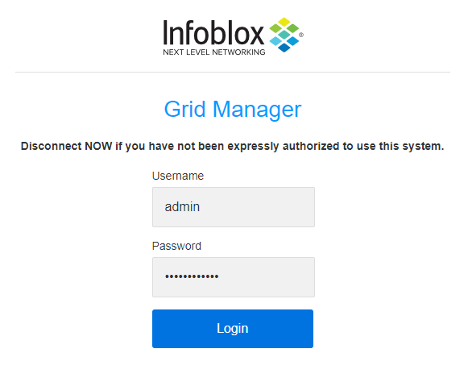

---
Accept the EULA

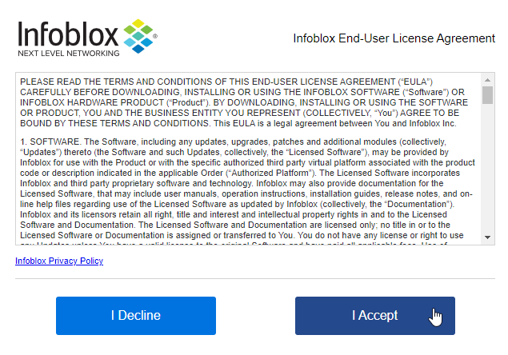

---
Opt in/out of the customer experience program

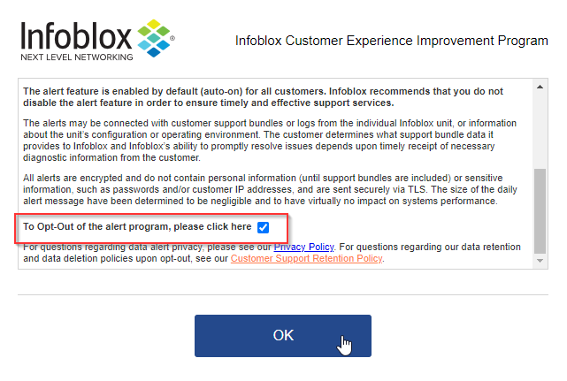

---
Close the Grid Setup Wizard

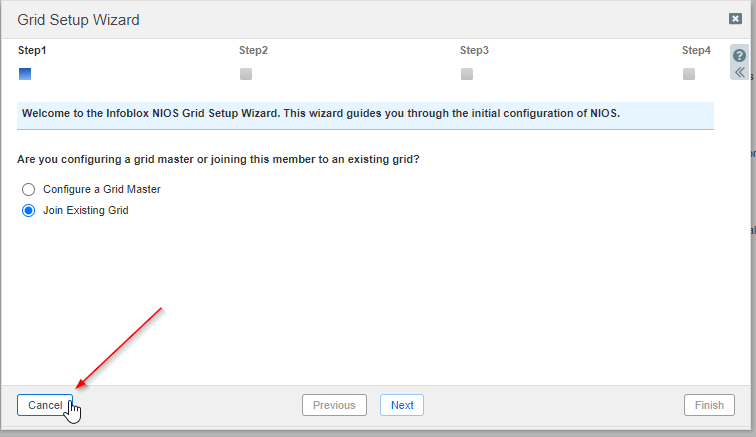
---

=== VSCODE

vscode is an easy-to-learn code editor.  It has support for many extensions, including Ansible code highlighting. This makes debugging Ansible much easier.  

---

First, login to vscode with the provided credentials

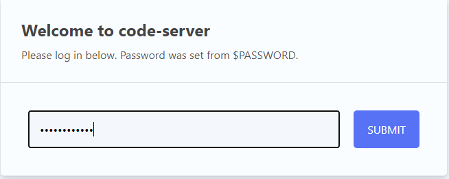

---
Next, open the /home/devops folder

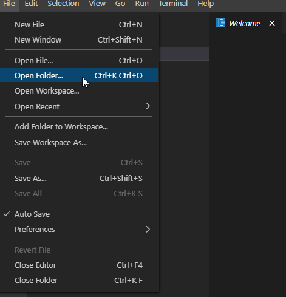

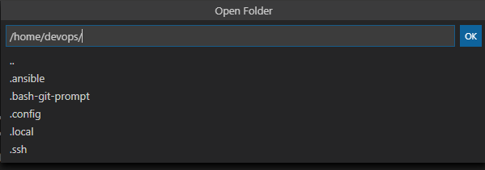

---
We can open a Terminal right in vscode. On the toolbar, go to `Terminal`,`New Terminal`. You can use this terminal to test playbooks before running them in Tower.

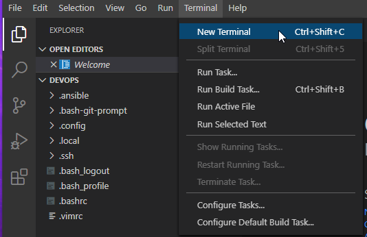

---
=== Ansible Tower 3.8

Ansible Tower is a powerful web UI and API for Ansible.  It provides role-based access control, scheduling, centralized logging, and many other benefits.

Tower is pre-populated with several assets you will need to run jobs with NIOS.  Let's login to Tower and review before we start our first project.

---

Login to Tower

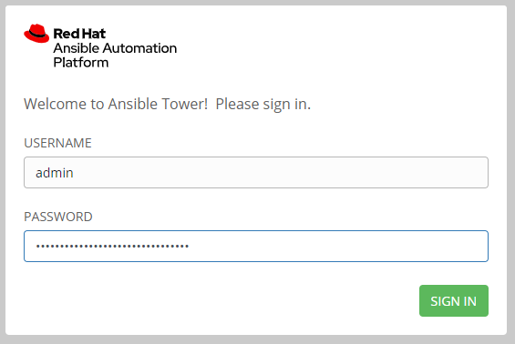

---
Once logged in, use the left-hand navigation pane to select `Administration`, then `Custom Credentials`.  Then choose `NIOS Custom Credentials`.

This Custom Credential allows us to pass `nios_grid_username` and `nios_grid_password` to our playbooks as extra vars.  This will be covered more in-depth later in the guide.

For now, just be aware that these variables are defined in the custom credential

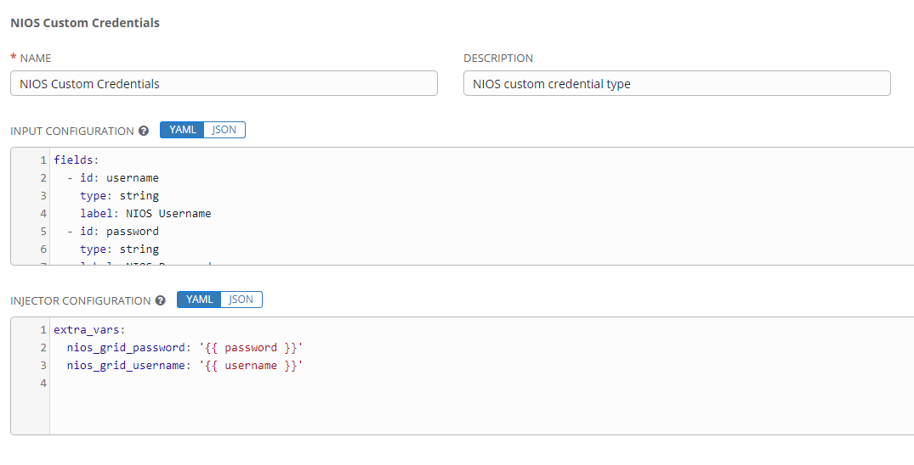 

---
Next, navigate to `Resources`, `Credentials`, then `nios creds`.  This is a credential of type `NIOS Custom Credentials` that has the NIOS username and password already defined. We'll use this as our credential in any jobs we create.

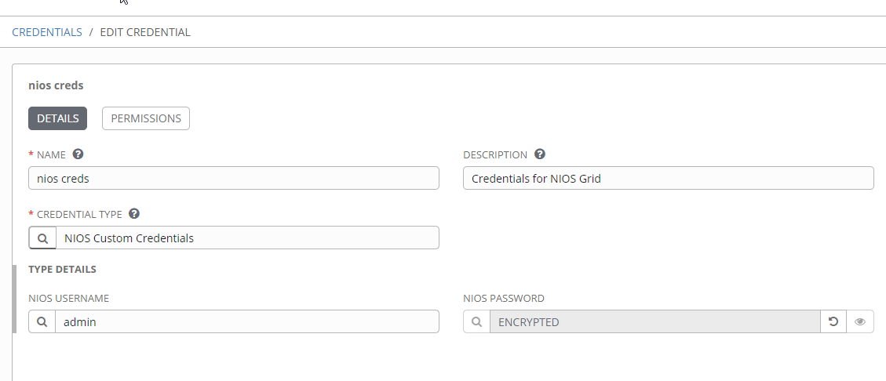

---
Finally, navigate to `Resources`, `Inventory`, then `nios`.  This inventory is pre-populated with several important variables. We will use this for our inventory for any jobs we create so the variables are automatically passed to our playbooks.

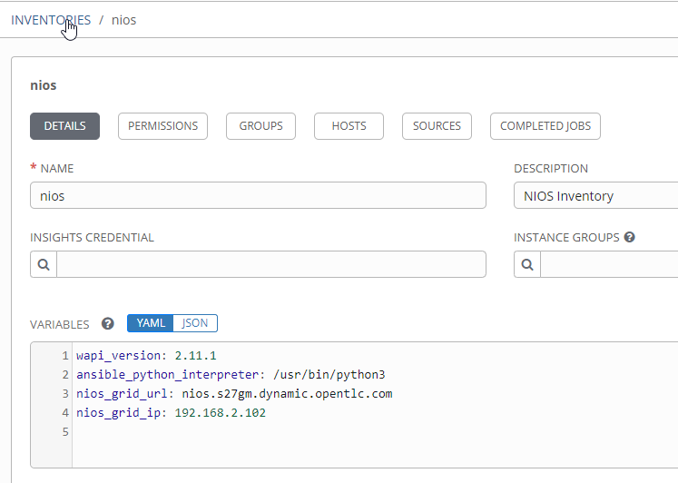

[options="header,footer"]
|=======================
|Variable           |Definition 
|wapi_version       | defaults to 2.11.1 
|ansible_python_interpreter |/usr/bin/python3 
|nios_grid_url      |public url used for API calls 
|nios_grid_ip       |private IP of the NIOS server 
|=======================

== NIOS Primer

NIOS has two primary network object types. Containers and Networks. Containers are special objects in NIOS that can be further divided. These divisions help to organize the IP addresses within NIOS.  We can create containers within containers, or create network objects, assign hosts, etc.  Network objects can have DHCP scopes assigned to them and cannot be further subnetted.

For instance, many organizations use RFC1918 IP addresses for their internal IP space.  We can use Ansible to create a 10.0.0.0/8 container in NIOS for us and then further divide that as needed.  In fact, when you logged into NIOS you have may have noticed that the 10.0.0.0/8 container was already there.  It was added during lab deployment.  

NIOS is configured via an API. In order for our bastion and Tower to communicate with this API, we need the `infoblox-client` python library installed. To avoid python incompatibility issues, this has been done for you in a python virtual environment.  In Tower, we'll use this python environment for all our jobs. 

IMPORTANT: You must run the following command in the terminal to activate the python virtual environment on the bastion:  
 `source /var/lib/awx/venv/nios/bin/activate`

== Lab Example

For this lab, we'll add a new container within 10.0.0/8.  Ansible will query NIOS for the next available container within a parent container and then create the container for us.  

Let's go back to vscode and create a playbook that adds a new network container to NIOS.  

---

TIP: For this next step it does not matter if you are in the virtualenv or not.  

TIP: You can create your own git repo instead of using the sample repo.

---

In the vscode terminal,  clone the repo.

CAUTION: Be sure to update the playbook with the correct url if you created your own repo.

[source,shell]
----
$ git clone https://github.com/gejames/infoblox-lab-guide.git
$ cd infoblox-lab-guide/
----

In the file explorer window in vscode, click on the new_network.yml file.  

It should look like this.

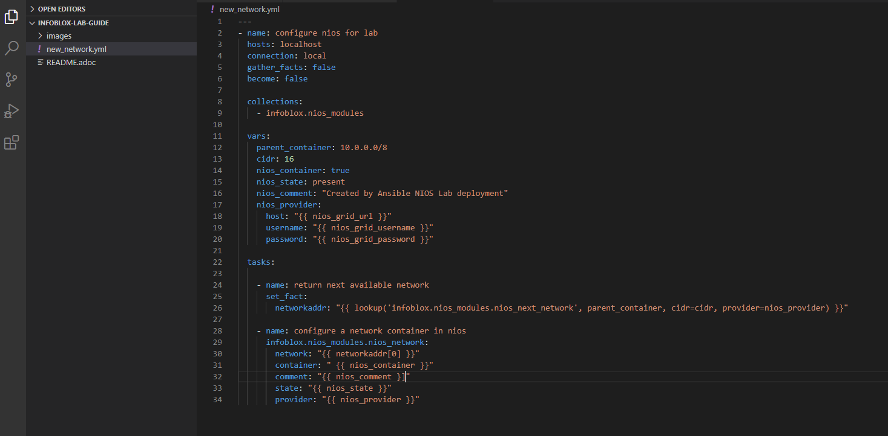

In order to pass credentials to NIOS, we define a dictionary called `nios_provider`.  

In Tower, we pass the NIOS url, username, and password to our playbook from the `nios creds` credentials and `nios` inventory extra vars.

[source,yaml]
nios_provider:
      host: "{{ nios_grid_url }}"
      username: "{{ nios_grid_username }}"
      password: "{{ nios_grid_password }}"

Next, take note of the `collections/requirements.yml` file. This file will be used by Tower to download the infoblox.nios_modules collection. 

[source,yaml]

collections:
  - infoblox.nios_modules

---
IMPORTANT: Be sure to include this file in any projects you create.

---

Now we can put the pieces together and add our playbook to Tower as a new Project and Job Template.

Log back into Tower and navigate to Resources/Projects.  Click on the  symbol to create a new Project

. Give your project a name. NIOS Lab
. For SCM Type, use Git
. Paste in the url for your repo. https://github.com/gejames/infoblox-lab-guide.git
. Use /var/lib/awx/venv/nios for your ansible environment. This will become the Default for any jobs we create with this project.
. Save your project.

image::images\tower-new-project.png[]

---

Next, go to Resources/Templates, and click on  to create a new Job Template.

. Name your new job
. Job type is Run
. Inventory: nios
. Project: NIOS Lab
. Playbook: new_network.yml
. Credentials: nios creds.  

Save your project by clicking the Save button.

image::images\tower-job-template.png[]

---

IMPORTANT: To pick `nios creds` you must first change the `Credential Type` to `NIOS Custom Credentials` when slecting the credential. 

---
Press the Launch button to start your job.

First, the playbook will reach out to NIOS and ask for the next available network in the defined parent container. The `cidr` variable defines what size subnet we want the container to be.  Due to the way cidr notation works, this number must be larger than the container cidr.  In this case the parent container is a /8 and we are asking for a /16. 

[source,yaml]
....
vars:
   parent_container: 10.0.0.0/8
   cidr: 16

- name: return next available network
      set_fact:
        networkaddr: "{{ lookup('infoblox.nios_modules.nios_next_network', parent_container, cidr=cidr, provider=nios_provider) }}"
....

The next available network will be returned in cidr notation, for example, 10.0.0.0/16

The playbook will then use the `infoblox.nios_modules.nios_network` module to create that container.

[source,yaml]
- name: configure a network container in nios
      infoblox.nios_modules.nios_network:
        network: "{{ networkaddr[0] }}"
        container: " {{ nios_container }}"
        comment: "{{ nios_comment }]"
        state: "{{ nios_state }}"
        provider: "{{ nios_provider }}"

---

Navigate back to Infoblox NIOS.  On the Data Management tab, you should see the new container.

image::images\infoblox-grid-example.png[]

== Conclusion

Red Hat Ansible Automation Platform and Infoblox NIOS are key components in any automation journey.  This lab can be used to showcase DDI automation or as a sandbox to learn automation with NIOS and Ansible. Having completed the lab guide, you should now be able to create your own playbooks and integrate NIOS into your ansible automation projects.

Happy Automating!

